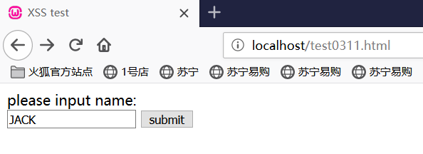
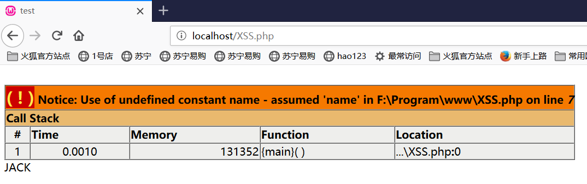
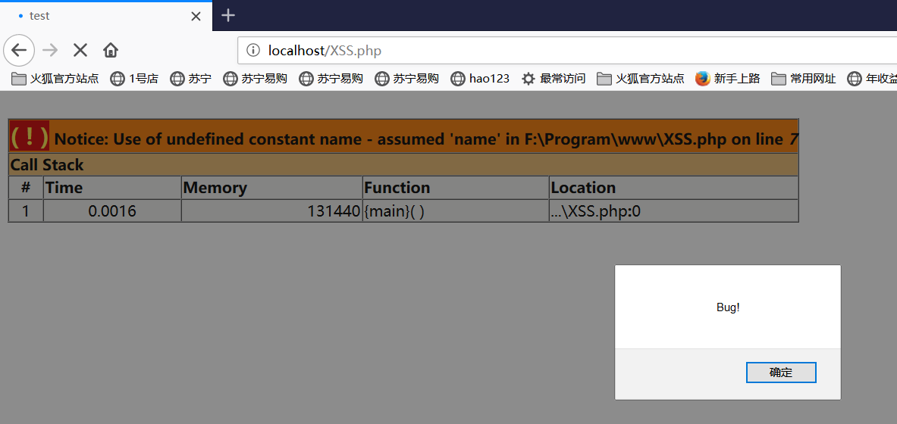
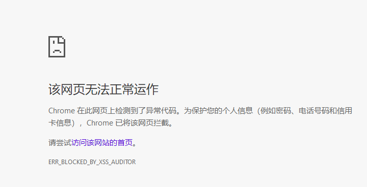

# XSS跨站脚本攻击

## 实验内容

* 搭建一个web服务器重现XSS
* 用户输入数据，点击submit,浏览器会把输入框中的数据封装为一个post请求，发现服务器，服务器会把这个数据发给后端脚本处理（这里后端脚本为XSS.php）。

## 实验环境

* wamp server

## 实验过程

* 安装wamp server，当图标变为绿色的时候可以继续实验

  

* 配置php
  
* 左键单击图标-php-php设置-勾选short_open-tag
  
* 在wamp的安装路径\www\文件夹中新建test.html和XSS.php

  * ```php+HTML
    <html>
    <head>
    <title>XSS test</title>
    </head>
    <body>
    <form action="XSS.php" method="POST">
    please input name:<br>
    <input type="text" name="name" value=""></input>
    <input type="submit" value="submit"></input>
    </body>
    </html>
    
    ```

    ```php+HTML
    <html>
    <head>
    <title> test </title>
    </head>
    <body>
       <?php
          echo $_REQUEST[name];
       ?>
    </body>
    </html>
    ```

    

* 浏览器进入` localhost/test.html`，即为我们刚刚写的页面，尝试输入JAKE并提交，可以看到我们提交的内容被后端脚本显示出来

  

  

* 如果我们在输入框里输入` <script>alert("Bug!")</script>`，再次尝试提交，可以看到在html页面输入的内容被当做脚本文件内容执行了

  

## 遇到的问题

* 浏览器不要使用360浏览器，会被拦截，这里使用火狐浏览器

