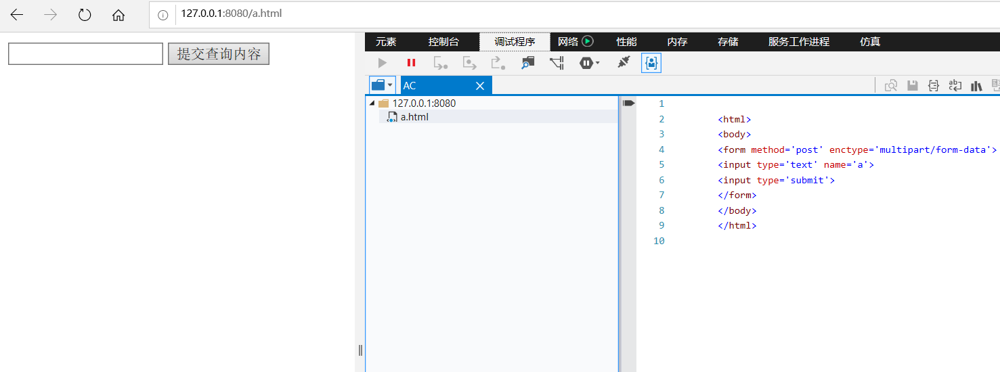
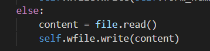
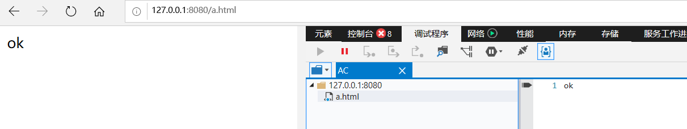
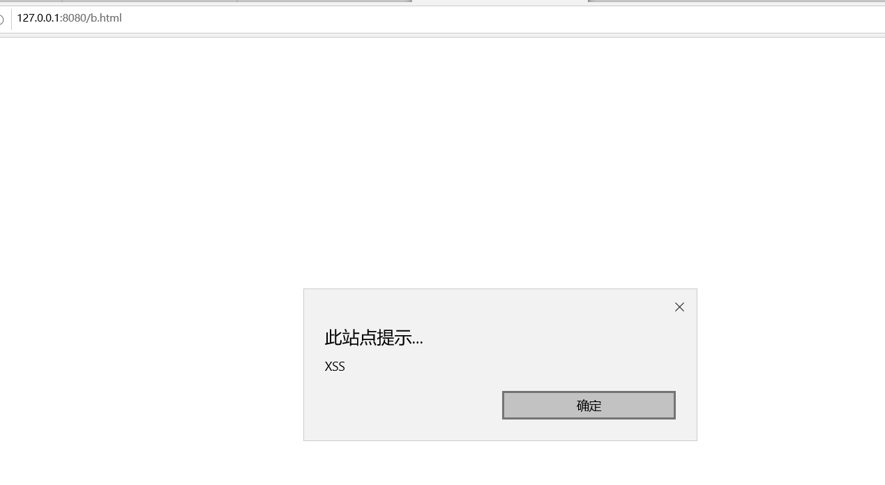
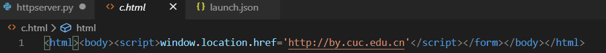
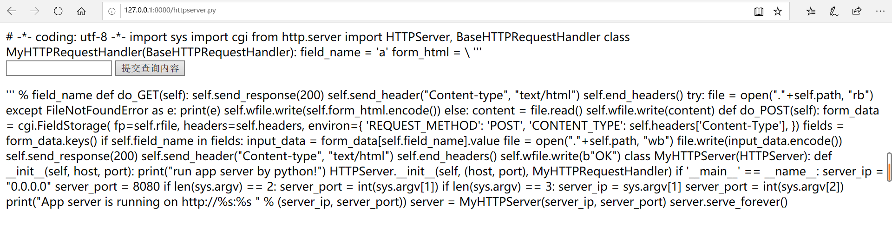
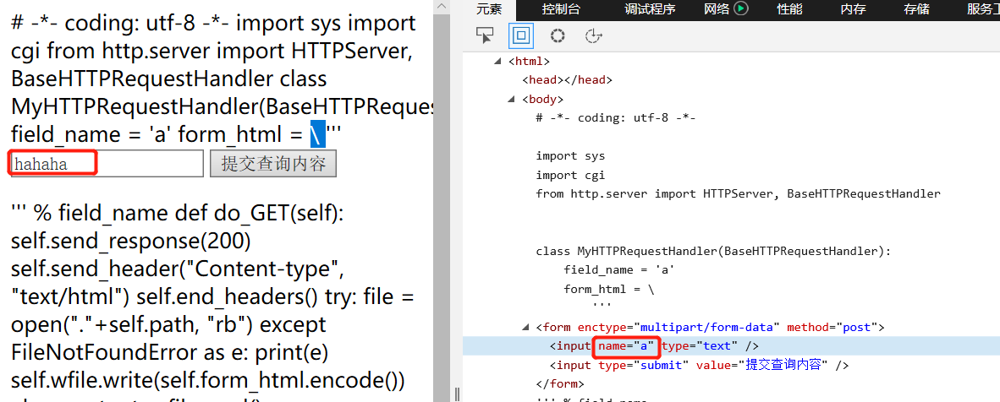
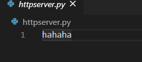

# 跨站脚本漏洞剖析

## 课堂实验复现

* 示例代码`httpserver.py`

  ```python
  # -*- coding: utf-8 -*-
  
  import sys
  import cgi
  from http.server import HTTPServer, BaseHTTPRequestHandler
  
  #关键是 MyHTTPRequestHandler 类，这个是 HTTPServer 的回调。
  #MyHTTPRequestHandler 直接 继承自 BaseHTTPRequestHandler，其中 BaseHTTPRequestHandler 的 do_GET和do_POST两个方法被重写
  class MyHTTPRequestHandler(BaseHTTPRequestHandler):
      field_name = 'a'
      form_html = \
          '''
          <html>
          <body>
          <form method='post' enctype='multipart/form-data'>
          <input type='text' name='%s'>
          #表单以变量名变量值的方式组织，input的name相当于变量名，你填入的数据就是变量值。
          <input type='submit'>
          </form>
          </body>
          </html>
          ''' % field_name
  
      def do_GET(self):
          self.send_response(200)
          self.send_header("Content-type", "text/html")
          self.end_headers()
          try:
              file = open("."+self.path, "rb")
          except FileNotFoundError as e:
              print(e)
              self.wfile.write(self.form_html.encode())
          else:
              content = file.read()
              self.wfile.write(content)
  
      def do_POST(self):
          form_data = cgi.FieldStorage(
              fp=self.rfile,
              headers=self.headers,
              environ={
                  'REQUEST_METHOD': 'POST',
                  'CONTENT_TYPE': self.headers['Content-Type'],
              })
          fields = form_data.keys()
          if self.field_name in fields:
              input_data = form_data[self.field_name].value
              file = open("."+self.path, "wb")
              file.write(input_data.encode())
  
          self.send_response(200)
          self.send_header("Content-type", "text/html")
          self.end_headers()
          self.wfile.write(b"<html><body>OK</body></html>")
  
  
  class MyHTTPServer(HTTPServer):
      def __init__(self, host, port):
          print("run app server by python!")
          HTTPServer.__init__(self,  (host, port), MyHTTPRequestHandler)
  
  
  if '__main__' == __name__:
      server_ip = "0.0.0.0"
      server_port = 8080
      if len(sys.argv) == 2:
          server_port = int(sys.argv[1])
      if len(sys.argv) == 3:
          server_ip = sys.argv[1]
          server_port = int(sys.argv[2])
      print("App server is running on http://%s:%s " % (server_ip, server_port))
  
      server = MyHTTPServer(server_ip, server_port)
      server.serve_forever()
  ```

  

* 运行代码，就可以在浏览器中访问 http://127.0.0.1:8080/a.html

  

* 提交ok数据

* 然后下次再访问 http://127.0.0.1:8080/a.html 时，在浏览器地址栏里回车，由于这个时候a.html已经存在了，直接把文件内容会写给浏览器。这里时在简化模拟用户提交数据-存入数据-其他用户获取这个数据的过程。这里有就XSS漏洞了。

  

  

* 下面再访问一个不存在的页面，比如`b.html`，又会出现那个默认的form。如果这时我们输入`<html><body><script>alert('XSS')</script></form></body></html>`，这段内容就会被写入`b.html`

* 然后再次访问`b.html`的时候，整个页面被载入 `script`在浏览器上执行

  

* 接着，我们再次访问c.html，并填入`<html><body><script>window.location.href='http://by.cuc.edu.cn'</script></form></body></html>`,下次再访问c.html的时候。页面跳转了，跳转为`by.cuc.edu.cn`。这就是 window.location.href='[http://by.cuc.edu.cn](http://by.cuc.edu.cn/)' 这段脚本的功能。即界面跳转漏洞，比如有一个商品A，你在评论里输入了一段js代码。如果服务器不做处理直接保存。后面的的用户访问商品A时，看评论，你输入的代码就会在其他用户的页面上执行。比如骗去用户支付，实际到账你的账户。

  

* 接着，我们看一个更严重的漏洞，如果在浏览器中访问`http://127.0.0.1:8080/httpserver.py`，我们能看到如下内容

  是我们的源代码,由于服务器没有做任何过滤，只要是存在的文件，就发送给客户端,源代码文件也发送给了客户端。现在黑客可以知道我整个后台的逻辑了。如果还有一些配置文件，比如数据库地址和访问口令等,那就更严重了。黑客甚至可以注入后端代码，由于我们是回写到文件，你可以构造一个http post请求，把httpserver.py文件改写了，但是构造这个请求用浏览器就不行了，需要采用curl等更基础的工具裸写post请求发送给服务器的。

  

* 比如，我们输入`hahaha`，把 name="%s" 改为 name="a" 再提交

  

* 可以看到本地代码也被篡改了

  

  

  