# SQL

##  实验过程

### 前期准备

* 安装django

  ```
  pip install -i https://pypi.tuna.tsinghua.edu.cn/simple django
  django-admin startproject mysite
  cd  mysite
  python manage.py startapp polls
  python manage.py runserver
  ```

* 访问 http://127.0.0.1:8000/，可以看到命令行中有请求的消息

  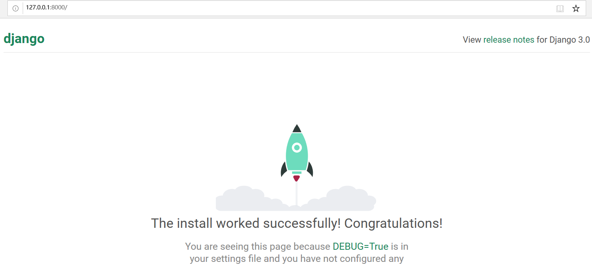

  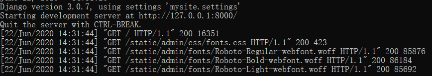

* 新建一个app

  ```
  python manage.py startapp edu_admin
  code.
  ```

  

* 然后用vscode打开mysite文件，将models.py文件移至edu_admin路径下

* 修改一下表结构

  ```python
  #models.py
  from django.db import models
  from django.contrib.auth.models import AbstractUser
  
  class Course(models.Model):
      name = models.CharField(verbose_name='课程名',  max_length=100)
      number = models.IntegerField(verbose_name='编号', default=0)
      summary = models.CharField(verbose_name='摘要', max_length=500, null=True)
  
      def __str__(self):
          return self.name
  
  class Student(models.Model):
      class_name = models.CharField(verbose_name="班级", max_length=100, blank=True, null=True)
      name = models.CharField(verbose_name="姓名", max_length=100, blank=True, null=True)
      number = models.IntegerField(verbose_name="学号", default=0)
      phone_number = models.CharField(verbose_name='手机号', max_length=11,null=True)
  
  class Score(models.Model):
      course = models.ForeignKey(Course, verbose_name='课程', on_delete=models.CASCADE, related_name='students')
      student = models.ForeignKey(Student, verbose_name='学生', on_delete=models.CASCADE, related_name='my_courses')
      score = models.FloatField(verbose_name='成绩',  null=True)
  ```

  

* 然后需要把这个表结构写入到数据库中，也就是create table的过程

* 打开mysite的settings.py,在INSTALLED_APPS这里增加一个edu_admin,表示 edu_admin 这个是我们这个site的一个app

  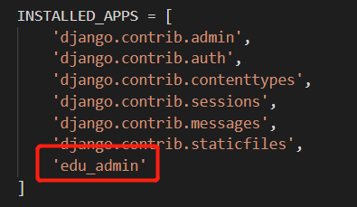

* 之前startapp命令只是创建了app，必须要把app写入到这里，这个app才会被纳入到站点功能中。

* 命令行输入以下命令，会出现一个db.sqlite3

  ```
  python .\manage.py makemigrations
  python .\manage.py migrate
  ```

  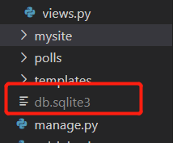

* 为了验证Django真的建立了表，我们去下载一个[sqlite](https://www.sqlite.org/download.html)的客户端软件，来看一下它的表结构。把这个exe加入在PATH环境变量，或者放在db.sqlite，然后执行 `sqlite3.exe db.sqlite3`

  

* 在sqlite中执行`.table`查看所有建好的表

  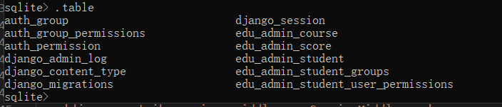

### Web搭建

* views是Django功能实现应用功能的地方。如果你想写一个动态的页面，就在views中定义一个函数。最基本的views函数，是收到一个HttpRequest类型的参数，需要返回一个HTTPResponse类型的返回值，

* 在edu_admin文件夹中写入以下内容，我们还需要把这个views，对应到一个路径上。也就是客户端如何调用这个views函数对应的功能，因为一个实用的web app只有一个views是不够的，可能有很多很多views，然后我们需要把这些views对应到不懂的url上。这样客户端才能访问。这个工作，是urls.py来完成的。

  ```python
  #viws.py
  from django.http import HttpResponse
  def index(request, pk):
      return HttpResponse('<html><body>hello world </body></html>' % pk)
  ```

  

* 下面我们在urls.py中写如下内容

  ```python
  urlpatterns = [
       path('index', index),
  ]
  
  ```

  

* 然后需要在主urls.py，也就是 mysite的urls.py中包括这个url配置。这是为了适应，可能有多个Django app共同工作的情况。

  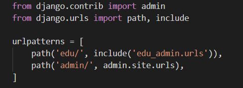

* 调试manage.py页面，生成一个 lanuch.json ，选python Django。Run之后访问 127.0.0.1:8000/edu/index

* 注意一个url是可以带参数的。views函数也是可以带参数的,可以将edu_admin下的views.py和url.py修改如下

  ```python
  #viws.py
  from django.http import HttpResponse
  def index(request, pk):
      return HttpResponse('<html><body>hello world %d</body></html>' % pk)
  #urls.py
  urlpatterns = [
       path('index/<int:pk>', index),
       path('myscore', my_score),
  ]
  ```

  

* 再访问 127.0.0.1:8000/edu/index/100，就可以有一个动态的效果

  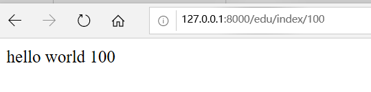

### 在Views中访问数据库

* 将Views.py修改如下

  ```python
  from django.shortcuts import render
  from django.contrib.auth.decorators import login_required
  from django.http import HttpResponse
  
  from .models import Score
  
  def index(request, pk):
      return HttpResponse('<html><body>hello world %d </body></html>' % pk)
  
  # Create your views here.
  
  @login_required
  def my_score(request):
      result = Score.objects.filter(student=request.user)
      return render(request, 'score.html', {'result': result})
  
  
  ```

  关键在第5行和第14行。先从models中导入模型类。然后调用这个模型类的objects的filter方法，就完成了一次sql select,filter函数的参数是就相当于查询的过滤条件

* 我们要查询的是 student为当前登录用户的Score表的记录

  ```python
  Score.objects.filter(student=request.user)
  ```

  

* Views写了还不够。我们还需要修改一下模型。Django是有默认的用户管理系统的。用户相关的数据库表结构其实Django已经建立好了。但是我们这里用了student表来作为系统用户。但是我们这里用了student表来作为系统用户。

* 首先在 models.py中 导入，这个是Django默认的用户管理的数据库模型,然后继承修改之

  ```python
  from django.contrib.auth.models import AbstractUser
  
  class Student(AbstractUser):
      class_name = models.CharField(verbose_name="班级", max_length=100, blank=True, null=True)
      name = models.CharField(verbose_name="姓名", max_length=100, blank=True, null=True)
      number = models.IntegerField(verbose_name="学号", default=0)
      phone_number = models.CharField(verbose_name='手机号', max_length=11,null=True)
  ```

  

* Student继承了AbstractUser后。告诉Django用Student作为系统用户管理的数据库模型。在mysite settings.py也就是整个站点的配置文件中，增加一条。告诉Django，使用 edu_admin 的Student作为用户管理登录授权的模型。

  ```python
  AUTH_USER_MODEL = 'edu_admin.Student'
  ```

  

* 代码修改完以后。这里涉及到数据库修改。所以要进行数据库表结构的migrate

  ```
  python manage.py makemigrations 
  python manage.py migrate
  ```

  

* 我们用Django的方式，先建立一个超级用户

  ```
  python manage.py createsuperuser
  ```

  

* Django的admin相当于一个数据管理的超级权限后台。可以直接操作数据库。在admin.py中录入以下内容。这样直接就可以生成一个管理数据库的后台页面。

  ```python
  from django.contrib import admin
  
  # Register your models here.
  from .models import Student, Course, Score
  
  class ScoreAdmin ( admin.ModelAdmin ):
      list_display = ('course', 'score', 'student')
  
  admin.site.register(Student)
  admin.site.register(Course)
  admin.site.register(Score, ScoreAdmin)
  
  ```

  

* 访问 http://127.0.0.1:8000/admin/ 刚才新建的用户 登录后看到这个页面。

  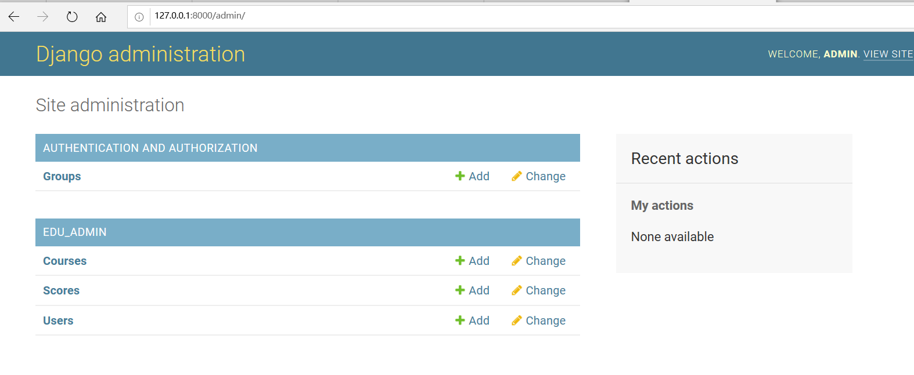

* 为了在admin管理的时候，直接显示课程名称，可以给course模型增加一个 __str__方法。这样所有course对象的str ，返回的是name字段。界面显示就是课程名称了，可以插入一些数据

* 当数据库有了值以后。我们就可以在view中验证，我们查询自己成绩的功能是否正常了。views中的@login_required表示需要登录。我们这里已经用超级管理员登录了，所以是可以访问的。

* render是一个Django内置的函数。用于在模板文件的基础上，通过渲染得到动态的网页效果。其中 score.html是模板,那么还需要一个score.html,在 templates目录下

  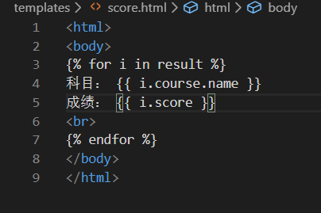

* 这里的result 就是 render传入的result,对每一个result 显示其课程名和分数,大家看到这里的多表查询 (course表中的name）直接. 就调用出来了。模板语言的语法 {{ 变量名 }}

* 然后访问，应该能得到结果。注意，写了新的views函数，需要增加url,注意，写了新的views函数，需要增加url,这就完成了当前登录用户（超级管理员 admin 同学）的成绩查询。注意，这里我们偷了一个懒，实际情况，并不是每个用户都是超级管理员。需要有普通用户登录注册页面。实际情况下普通用户 是不能访问 127.0.0.1:8000/admin页面的。

### SQL注入

在不使用Django的情况下，我们可以使用更底层的pyhton的sqlite库来编程操作数据库，可以在httpserver.py的基础上，继续编写漏洞。写两个页面，一个是教师录入成绩页面，一个是学生查询成绩页面。教师录入成绩页面表单有三个字段，课程id，学生id，成绩。录入提交以后，httpserver调用sqlite库使用sql语句写入数据库。然后是学生查询成绩表单，学生输入学生id，课程id，httpserver使用sql语句查询成绩后返回给用户。这里不需要做登录功能，课程也用直接输入id而不是下拉菜单的方式，或者其他选择的方式，而是直接输入id。为了体验最原始的web的开发过程。（实战中`sql_injection.py`实现）

* 下面是存在sql漏洞的代码

  ```python
  # -*- coding: utf-8 -*-
  
  import sys
  import cgi
  from http.server import HTTPServer, BaseHTTPRequestHandler
  
  
  class MyHTTPRequestHandler(BaseHTTPRequestHandler):
      field_name = 'a'
      form_html = \
          '''
          <html>
          <body>
          <form method='post' enctype='multipart/form-data'>
          <input type='text' name='%s'>
          <input type='submit'>
          </form>
          </body>
          </html>
          ''' % field_name
  
      def do_GET(self):
          self.send_response(200)
          self.send_header("Content-type", "text/html")
          self.end_headers()
          self.wfile.write(self.form_html.encode())
  
  
      def do_POST(self):
          form_data = cgi.FieldStorage(
              fp=self.rfile,
              headers=self.headers,
              environ={
                  'REQUEST_METHOD': 'POST',
                  'CONTENT_TYPE': self.headers['Content-Type'],
              })
          fields = form_data.keys()
          if self.field_name in fields:
              input_data = form_data[self.field_name].value
              # 单表查询，只显示pk，不显示课程名。
              #sql = 'SELECT course_id, score FROM edu_admin_score WHERE student_id = %s' % input_data
              # 多表查询，通过成绩表中课程fk查出课程名。
              sql = 'SELECT edu_admin_course.name, edu_admin_score.score FROM edu_admin_score INNER JOIN edu_admin_course ON edu_admin_score.course_id=edu_admin_course.id WHERE student_id = %s ' % input_data
  
              import sqlite3
              conn = sqlite3.connect('db.sqlite3')
              c = conn.cursor()
              query_result = c.execute(sql)
              response_content = ''
              for i in query_result:
                  #response_content += '科目： %i 成绩： %.2f <br>' % i
                  response_content += '科目： %s 成绩： %.2f <br>' % i
              conn.close()
  
              self.send_response(200)
              self.send_header("Content-type", "text/html;charset=utf-8")
              self.end_headers()
              self.wfile.write(( "<html><body>%s</body></html>" %response_content ).encode('UTF-8') )
  
  
  
  class MyHTTPServer(HTTPServer):
      def __init__(self, host, port):
          print("run app server by python!")
          HTTPServer.__init__(self,  (host, port), MyHTTPRequestHandler)
  
  
  if '__main__' == __name__:
      server_ip = "0.0.0.0"
      server_port = 8080
      if len(sys.argv) == 2:
          server_port = int(sys.argv[1])
      if len(sys.argv) == 3:
          server_ip = sys.argv[1]
          server_port = int(sys.argv[2])
      print("App server is running on http://%s:%s " % (server_ip, server_port))
  
      server = MyHTTPServer(server_ip, server_port)
      server.serve_forever()
  
  ```

  

* 运行该文件

  ```
  python sql_injections.py
  ```

  

* 访问网页

  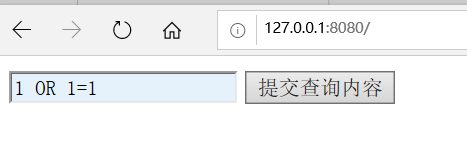

* 如果输入`1 OR 1=1`则查出了当前系统中所有用户的成绩。相当于整个数据库我都获得了。问题在代码的43行，我们直接把用户输入的数据，作为sql语句中的查询条件。最后的 sql语句为： 查询条件变成了 student_id = 1 OR 1=1,1=1恒为真， 任何数OR真值，也是真

  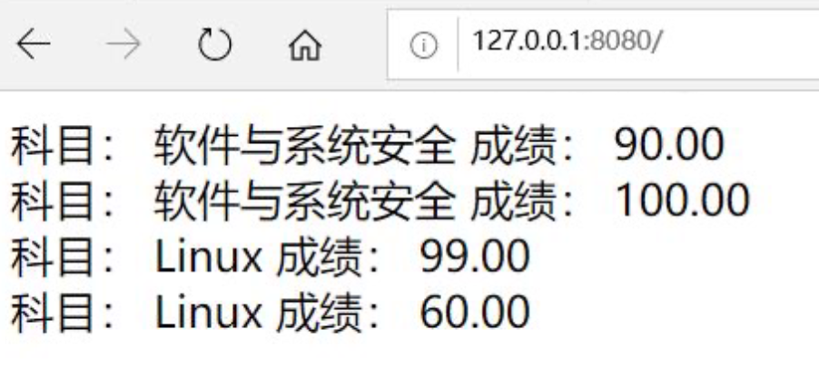

* 避免该漏洞有两种方法，一种就是对用户输入进行过滤，比如这里。我们可以判断一下 input_data 是否数字就可以。用python内置函数 isdigit，就可以判断，但是对于大型的系统，会有很多sql语句拼接和执行的地方。每一个都去过滤，编程效率很低，而且不一定能保证你写的过滤就是对的。ORM完全避免了程序员直接接触sql语言，所有的sql语句都在模型管理器中有框架进行拼接。程序员在编程时，只需要使用模型管理器提供的方法进行查询，创建等，就可以了。比如，我们之前写的Django代码。`result = Score.objects.filter(student=request.user)`底层在进行sql的拼接。Django的模型管理器中，主要有filter get等获取数据的方法。

* 这些方法返回的数据类型是QuerySet数据类型。这个数据类型是一个数据库访问的接口。在调用filter时，实际上还未查询数据库，只是初步完成了数据库sql语句的拼接。实际的查询是在render中进行的。Django会根据render时需要的具体数据，来精确优化查询语句，所有这里的result，并不是真正的查询结果。而是一个查询对象。

* 在模板 score.html 我们用到了 数据 {{ i.course.name }},course是 socre表的一个外键，course.name实际是在course表中。所有这里其实是一个跨表查询。这种两个表的跨表查询，我们自己写的sql语言已经比较复杂了。真实系统往往会有多个表的联合跨表查询，sql语句会非常复杂。但是Django处理后，查询数据库的操作就变得非常简单，把数据中的值得访问，编程了python对象的属性访问。

* 但是，从学习的角度，我们需要知道Django内部是怎么做的，也就是我也需要一些底层的http server的开发原理，比如request response模式，html sql语言，数据库表结构等。底层知识要了解。这有助于我们理解Django的工作原理，学习起来就很快。对一些高级的操作也能比较深入理解。

* 补充两点 ，student_id = 1; DROP TABLE xxx,这种注入方式，可以获得任意表的数据.在sqlite中，可以用PRAGMA table_info(table_name);取得表项的名字。