# 内存地址

## 实验目的

## 实验要求

-  验证不同进程的相同的地址可以保存不同的数据
  -  在 VS 中，设置固定基地址，同时运行两个不同的可执行文件。然后使用调试器附加到两个程序的进程，查看内存，看两个程序是否使用了相同的内存地址
  -  在不同的进程中，尝试使用 VirtualAlloc 分配一块相同地址的内存，写入不同的数据。再读出
-  配置一个 Windbg 双机内核调试环境，查阅 Windbg 的文档，了解
  -  Windbg 如何在内核调试情况下看物理内存，也就是通过物理地址访问内存
  -  如何查看进程的虚拟内存分页表，在分页表中找到物理内存和虚拟内存的对应关系。然后通过 Windbg 的物理内存查看方式和虚拟内存的查看方式，看同一块物理内存中的数据情况

## 实验过程

### 验证不同进程的相同的地址可以保存不同的数据

* 编写两个不同的可执行文件`ProjectA`和`ProjeciB`并设置相同基地址

  ```c
  #ProjectA
  #include<stdio.h>
  int main() 
  {
  	char array[] = "A:hello world";
  
  	printf("%s", array);
  	return 0;
  }
  
  #ProjectB
  #include<stdio.h>
  int main()
  {
  	char array[] = "B:hello world";
  
  	printf("%s", array);
  	return 0;
  }
  ```

  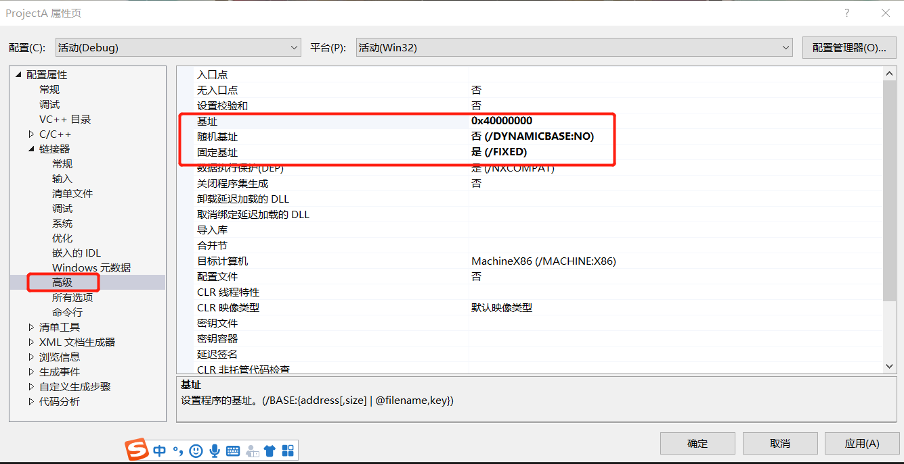

* 下断点开始调试

* 查看`ProjectA`和`ProjectB`的内存，可以看到两个进程在相同的内存地址下存储的信息不同

  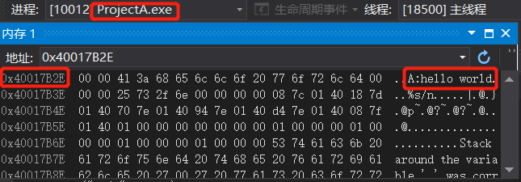

  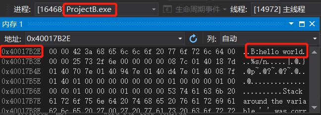

* 使用VirtualAlloc分配一块相同地址的内存

  ```C
  #include<stdio.h>
  #include<windows.h>
  int main()
  {
  	LPVOID lpvBase;	
  	LPTSTR lpPtr;
  	SYSTEM_INFO sSysInfo;	
  	GetSystemInfo(&sSysInfo);
  	DWORD dwPageSize = sSysInfo.dwPageSize;
  
  	lpvBase = VirtualAlloc(
  		(LPVOID)0x70000000,	
  		dwPageSize,
  		MEM_COMMIT | MEM_RESERVE,
  		PAGE_READWRITE);
  	lpPtr = (LPTSTR)lpvBase;
  	for (DWORD i = 0; i < dwPageSize; i++)
  	{
  		lpPtr[i] = 'A'; // ProjectA为'A'，ProjectB为'B'
  		printf("%c", lpPtr[i]);
  	}
  	VirtualFree(lpvBase, 0, MEM_RELEASE);
  	return 0;
  }
  ```

  

* 下断点进行调试，可以看到两个进程在相同地址下存储的数据不同

  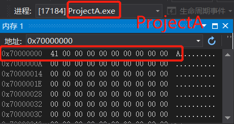

  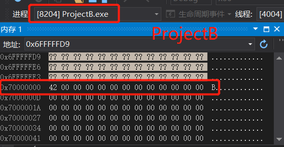

### 配置 `Windbg `双机内核调试环境

这里需要直接调试的是操作系统内核，所以需要两台`windows`计算机使用串口进行连接

- 安装`win7`虚拟机(`64bit`)

- 为虚拟机配置虚拟串口

- 进入虚拟机后，以管理员身份运行命令行，输入以下命令

  ```
  bcdedit /copy {current} /d "Windwos7"
  bcdedit /debug ON
  bcdedit /bootdebug ON
  bcdedit /timeout 10
  ```

  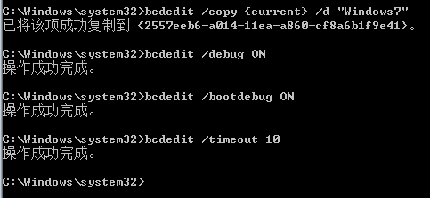

- 配置完成后，重新启动系统

- 选择`Windows7[启用调试程序]`

  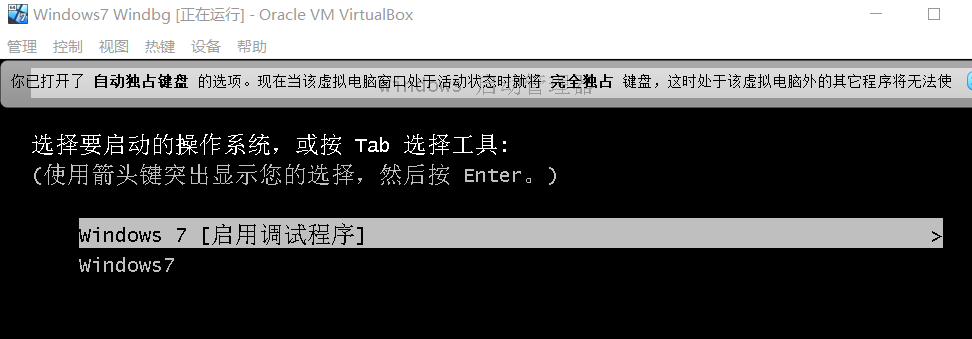

- 打开`Windbg`，在`Symbol Search Path`中输入`SRV*E:\mysymbol* http://msdl.microsoft.com/download/symbols`

  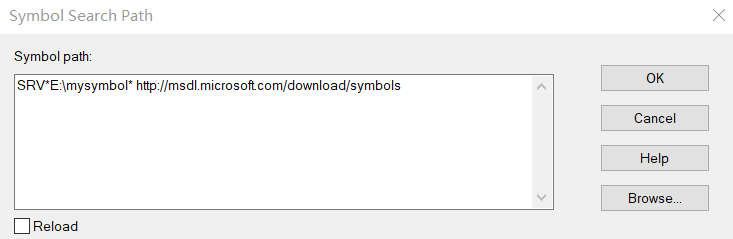

- 在本机用管理员打开命令行，进入`Windbg`安装目录，执行`windbg.exe -b -k com:port=\\.\pipe\com_1,baud=115200,pipe`，连接到`win7`，默认对虚拟机下断点进行调试，此时虚拟机就会被暂停，需要`GO`进行刷新，一次不行多go几次

  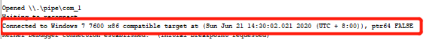

- 打开记事本，输入`hello world`,然后`break`按钮断开

  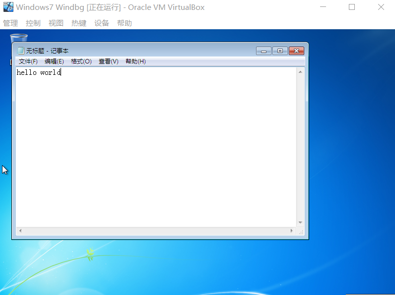

- 使用!process 0 0命令查看当前系统所有的进程信息，找到记事本所在进程

- 切换到记事本的进程，使用`.process -i +进程块地址`命令，再输入 g 命令将`WinDbg`当前调试进程切换到`notepad.exe`，然后使用s -u命令再记事本进程中搜索预先输入的字符串

  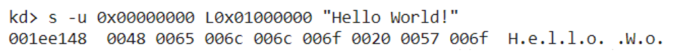

## 遇到的问题

- 从`Mircosoft`安装的`Windbg`默认路径在C盘下，且安装的目录会被隐藏，找到目录后也会提示无写入权限，故通过其他方式下载
