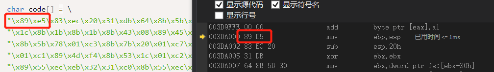
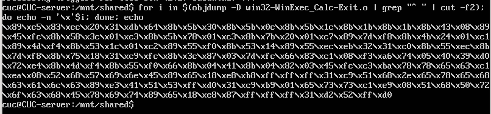

# Shellcode

## 实验内容

* 详细阅读 www.exploit-db.com 中的shellcode。建议找不同功能的，不同平台的 3-4个shellcode解读。
* 修改示例代码的shellcode，将其功能改为下载执行。也就是从网络中下载一个程序，然后运行下载的这个程序。提示：Windows系统中最简单的下载一个文件的API是 UrlDownlaodToFileA

## 课堂实验重现

* https://www.exploit-db.com/shellcodes/48116，打开链接并拷贝###########后整个C语言部分到本地.c文件中

* 编译链接运行，会出现内存访问异常

* 下断点打开调试，转到反汇编，按F11单步步入执行，找到错误点

  

* 由于code是全局变量，是数据，通常情况下，会给数据设置可读和可写的内存保护属性，但是一般不会给执行属性。我们可以修改内存保护属性来解决这个问题，使用`VirtualProtect`函数，则现在主函数为

  ```c
  int main(int argc, char **argv)
  {
  	int(*func)();
  	DWORD dwOldProtect;
  	func = (int(*)()) code;
  	VirtualProtect(func, sizeof(code), PAGE_EXECUTE_READWRITE, &dwOldProtect);
  	
  	(int)(*func)();
  }
  ```

* 重新运行该程序，成功调出计算器程序

  

* 转到反汇编，F11单步步入，可以看到内容和和源代码中的汇编部分是一样的，而字节码部分而字节码部分 89 e5 ... 是和 code一样的。code反汇编之后，就是汇编的源码。其实，我们这段code，就是通过前面的汇编代码，编译以后直接从汇编编译以后，从可执行文件中 dump出来的。

  

  

* 将图中的代码保存为`win32-WinExec_Calc-Exit.asm`设置共享文件夹，并在linux虚拟机中运行以下命令

  ```bash
  nasm -f win32 win32-WinExec_Calc-Exit.asm -o win32-WinExec_Calc-Exit.o
  for i in $(objdump -D win32-WinExec_Calc-Exit.o | grep "^ " | cut -f2); do echo -n '\x'$i; done; echo
  ```

  

  

* 如果我们是在C语言中编写调用WinExec函数，那个call之后的WinExec函数的地址，是编译器帮我们在可执行程序的导入表中导入了。code这段代码，如果要call WinExec，那么WinExec函数在哪？没人告诉code。也就是说，shellcode，其实干了一个进程初始化的过程中，操作系统在干的事情——API函数的动态链接，也就是找到需要调用的API函数的地址。为了获得API地址，黑客们逆向分析了Windows系统的内部代码，分析了Windows系统内部管理进程初始化相关的数据结构，发现有一个链表，管理了所有的已经加载的dll文件。

* 这个链表，就是我们这个代码里InitOrderModuleList 
  这个InitOrderModuleList 在一个称为 LDR 的数据结构里。
  这个LDR的数据结构，又在 PEB这个数据结构里，而PEB数据结构，在每个进程中，是一个固定的位置，是一个绝对的常量地址。这个地址就是fs:ebx+0x30
  所以地址就可以不依赖于任何API或者其他依赖，直接用汇编代码就能访问到。从这里我们能一层层找到dll的基地址，然后再从dll的基地址，通过PE文件的数据结构，文件头，找到dll的导出表，在导出表中的数据结构中，通过函数名称的比较，得到已经在内存中的函数的地址。

* 上面这些说到的系统的数据结构，都是固定的结构，在每个系统中都是一样的，所以可以固定。，通过系统中若干数据结构这种原始的访问方式，可以找到API函数。

*  shellcode中还用到了字符串。至少函数地址的名称是需要的。还有调用WinExec的参数 calc.exe，如果我们在C语言里编程，编译器会把可执行程序的代码和字符串，放在不同的地址。代码，机器指令在 text段中， 字符串在data段中。地址相差很远。

* 而我们objdump，只取了代码段，没有取数据段，那要shellcode就太大了，而且中间可能会有很多的填充字符。而且数据地址很有可能是绝对地址。

* code一dump出来，放在了其他环境中执行，那么地址就变了。所以字符串，code也是找不到的。编一个程序，用到字符串，可以看看字符串的地址和代码的地址，差很远。那唯一的办法，用一种什么方式，把字符串硬编码在shellcode中。让字符串，变为代码的一部分，内嵌在机器指令中。

* 636c6163，6578652e是 calc.exe的big ending 反写。压入栈以后，就形成了字符串。这样就把字符串嵌入机器指令了，作为机器指令的操作数。

## 其他Shellcode
* Windows/x64 - WinExec Add-Admin Dynamic Null-Free Shellcode 
  - 在本地计算机中添加一个管理员权限的用户账户，用户名称为`ROOT`，密码为`I@mR00T$`
  - 
  - 

* Windows/x86 - user32!MessageBox(Hello World!) + Null-Free Shellcode 

  - 弹出一个`hello world'消息框
  - 
  - 

* Linux/x86_64 - Delete File (test.txt) Shellcode 

  - 将文件夹中的`test.txt`文件删除

  - 在Ubuntu下安装GCC和其他一些Linux系统有点不一样，ubuntu 18.04下安装gcc命令：

    ```bash
    sudo apt-get  install  build-essential
    ```

  - 在`linux`虚拟机中新建`delect.c`文件，将代码复制进去，输入命令，将.c文件编译链接成可执行文件

    ```shell
    gcc -fno-stack-protector -z execstack delect.c -o delete
    ```

  - 运行文件`./delete`

  - 可以看到`test.txt`文件被删除

    

### 编写下载执行的Shellcode

* 
