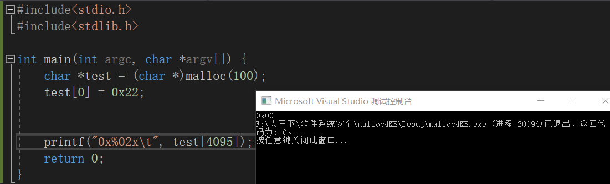
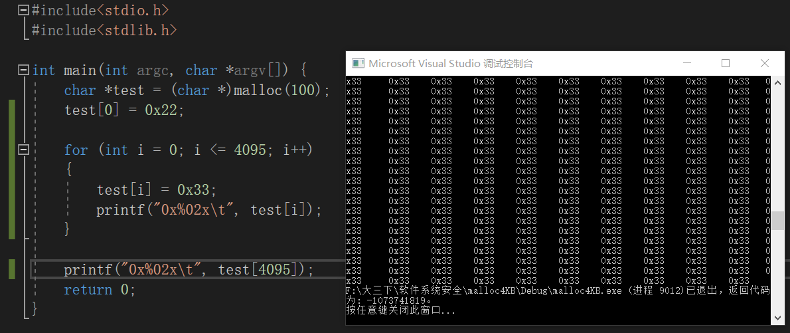
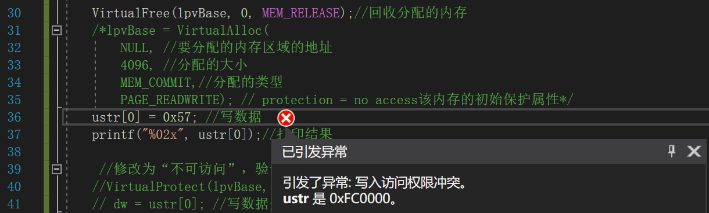
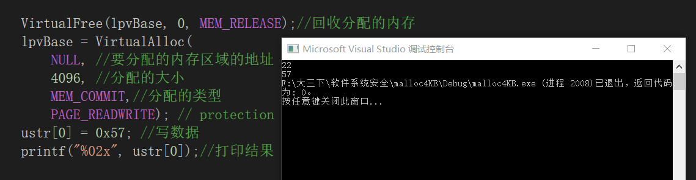

作业：

1、阅读VirtualAlloc、VirtualFree、VirtualProtect等函数的官方文档。

* [VirtualAlloc]:https://docs.microsoft.com/en-us/windows/win32/api/memoryapi/nf-memoryapi-virtualalloc

* [VirtualFree]:https://docs.microsoft.com/en-us/windows/win32/api/memoryapi/nf-memoryapi-virtualfree

* [VirtualProtect]:https://docs.microsoft.com/en-us/windows/win32/api/memoryapi/nf-memoryapi-virtualprotect

2、编程使用malloc分配一段内存，测试是否这段内存所在的整个4KB都可以写入读取。

* 运行以下程序

  ```c
  #include<stdio.h>
  #include<stdlib.h>
  
  int main(int argc, char *argv[]) {
  	char *test = (char *)malloc(100);
  	test[0] = 0x22;
  	
  	printf("0x%02x\t", test[4095]);
  	return 0;
  }
  ```

  

* 可以看到虽然只分配了100字节的内存，但是可以读取到test[4095]的内容

  

* 尝试写入读取整个4KB

  ```c
  for (int i = 0; i <= 4095; i++)
  	{
  		test[i] = 0x33;
  		printf("0x%02x\t", test[i]);
  	}
  ```

  

3、使用VirtualAlloc分配一段，可读可写的内存，写入内存，然后将这段内存改为只读，再读数据和写数据，看是否会有异常情况。然后VirtualFree这段内存，再测试对这段内存的读写是否正常。

* 运行以下代码，将内存改为只读

  ```c
  #include <windows.h>
  #include<stdio.h>
  
  void main()
  {
  	SYSTEM_INFO sf;
  	GetSystemInfo(&sf);
  
  	//分配内存，标记为提交、可读可写
  	LPVOID lpvBase = VirtualAlloc(
  		NULL, //要分配的内存区域的地址
  		4096, //分配的大小
  		MEM_COMMIT,//分配的类型
  		PAGE_READWRITE); // protection = no access该内存的初始保护属性
  	if (lpvBase == NULL)
  		return;
  	//向该内存中存入一个原数据
  	unsigned char *ustr = (unsigned char *)lpvBase;
  	ustr[0] = 0x22;
  	printf("%02x\n", ustr[0]);
  
  	//只读
  	DWORD dw;
  	VirtualProtect(lpvBase, 4096, PAGE_READONLY, &dw);
  	ustr[0]=0x55; //写数据
  	printf("%02x", ustr[0]);//打印结果
  	return ;
  }
  
  ```

  

* VirtualFree这段内存后，对该内存进行读写，发生访问冲突

* ```c
  #include <windows.h>
  #include<stdio.h>
  
  void main()
  {
  	SYSTEM_INFO sf;
  	GetSystemInfo(&sf);
  
  	//分配内存，标记为提交、可读可写
  	LPVOID lpvBase = VirtualAlloc(
  		NULL, //要分配的内存区域的地址
  		4096, //分配的大小
  		MEM_COMMIT,//分配的类型
  		PAGE_READWRITE); // protection = no access该内存的初始保护属性
  	if (lpvBase == NULL)
  		return;
  
  
  	//向该内存中存入一个原数据
  	unsigned char *ustr = (unsigned char *)lpvBase;
  	ustr[0] = 0x22;
  	printf("%02x\n", ustr[0]);
  
  	//只读
  	DWORD dw;
  	VirtualProtect(lpvBase, 4096, PAGE_READONLY, &dw);
  	
      VirtualFree(lpvBase, 0, MEM_RELEASE);//回收分配的内存
  	ustr[0] = 0x57; //写数据
  	printf("%02x", ustr[0]);//打印结
  
  	return ;
  
  }
  
  ```

  

* 再使用VirtualAlloc分配内存后进行读写，正常

  


