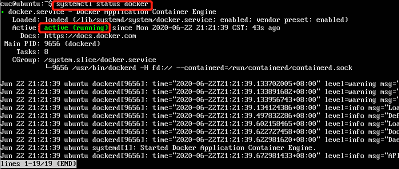
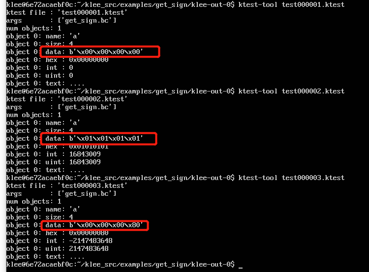
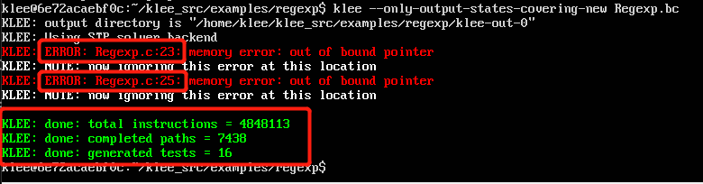

# 符号执行

 ## 实验要求

* 安装KLEE，完成官方tutorials。至少完成前三个，有时间的同学可以完成全部一共7个。

## 实验环境

* ubuntu 18.04 server

## 实验过程

### 前期准备

* 安装`docker`

  ```bash
  $ sudo apt-get update
  #安装以下包以使apt可以通过HTTPS使用存储库（repository）：
  $ sudo apt-get install -y apt-transport-https ca-certificates curl software-properties-common
  #添加Docker官方的GPG密钥：
  $ curl -fsSL https://download.docker.com/linux/ubuntu/gpg | sudo apt-key add -
  #使用下面的命令来设置stable存储库：
  $ sudo add-apt-repository "deb [arch=amd64] https://download.docker.com/linux/ubuntu $(lsb_release -cs) stable"
  #再更新一下apt包索引：
  $ sudo apt-get update
  #安装最新版本的Docker CE
  $ sudo apt-get install -y docker-ce
  ```

  验证`docker`是否安装成功

  ```bash
  #查看docker服务是否启动：
  $ systemctl status docker
  #若未启动，则启动docker服务：
  $ sudo systemctl start docker
  #测试
  $ sudo docker run hello-world
  ```

  

* 在`docker`中安装`KLEE`

  ```bash
  # 启动 docker
  systemctl start docker
  # 安装 KLEE(可太慢了),换源会好
  sudo docker pull klee/klee:2.0
  
  # 创建一个临时容器
  sudo docker run --rm -ti --ulimit='stack=-1:-1' klee/klee:2.0
  
  # 创建一个长期容器
  sudo docker run -ti --name=klee_cuc --ulimit='stack=-1:-1' klee/klee
  # 退出后可通过名字再次进入
  sudo docker start -ai klee_cuc
  # 删除长期容器
  docker rm klee_container
  ```

  

  

### 官方tutorials完成

#### [1 First tutorial](http://klee.github.io/tutorials/testing-function/): Testing a small function

* 程序代码如下，用来判断一个整数的正，负，或者为0.

  ```c
  //klee_src/examples/get_sign
  #include <klee/klee.h>
   
  int get_sign(int x) {
    if (x == 0)
       return 0;
    
    if (x < 0)
       return -1;
    else 
       return 1;
  } 
   
  int main() {
    int a;
    klee_make_symbolic(&a, sizeof(a), "a");
      //klee_make_symbolic()函数可以将变量标记为符号 它有三个参数  1是变量的地址  2是变量的大小  三是符号名字（任意的）
    return get_sign(a);
  }
  ```

  

* 其中，`klee_make_sybolic`是`KLEE`自带的函数，用来产生符号化的输入。由于`KLEE`是基于`LLvm`的  所有进行符号执行的第一步是要将c源代码转换为`LLvm`位代码 。首先，我们进入到该文件目录`~/klee_src/examples/get_sign`下执行命令

  ```bash
  clang -I ../../include -emit-llvm -c -g -O0 -Xclang -disable-O0-optnone get_sign.c
  ```

  其中，参数-I是为了编译器找到头文件`klee/klee.h`,`-g`是为了在字节码文件中添加`debug`信息，这会创建一个`get-sign.bc`文件

  

* 运行`KLEE`在这个`LLvm`代码上

  ```bash
  $ klee get_sign.bc
  ```

  

* 可以看到结果中`KLEE`给出了总指令数，完整路径和生成的测试案例数。

  最后，我们看当前目录下多生成了两个文件：`klee-last` 和 `klee-out-0`。其中`klee-out-0`是本次测试结果，`klee-last`是最新测试结果，包含最新测试的缺陷说明和测试样例等文件，每次测试后覆盖。

* 从中可以看出，该测试函数有3条路径，并且为每一条路径都生成了一个测试例，每一个路径对应输入变量值。`KLEE`执行输出信息都在文件`klee-out-N`中，不过最近一次的执行生成的目录由`klee-last`快捷方式指向。查看生成的文件：

  

  

* 利用测试例运行程序, 用生成的测试例作为输入运行程序，命令及结果如下：

  ```bash
  # 设置除默认路径外查找动态链接库的路径
  $ export LD_LIBRARY_PATH=~/klee_build/lib/:$LD_LIBRARY_PATH
   # 将程序与 libkleeRuntest 库链接
  $ gcc -I ../../include -L /home/klee/klee_build/lib/ get_sign.c -lkleeRuntest
          #gcc编译生成a.out，一个可执行程序，然后用下面的方式指定其输入为test000001.ktest。
  $ KTEST_FILE=klee-last/test000001.ktest ./a.out
  $ echo $?
  ```

  

#### [2 Second tutorial](http://klee.github.io/tutorials/testing-regex/): Testing a simple regular expression library

* 代码`Regexp.c`位于`/home/klee/klee_src/examples/regexp`目录下，测试一个简单的正则表达式的匹配函数。

* c源代码转换为`LLvm`位代码

  ```bash
  clang -I ../../include -emit-llvm -c -g -O0 -Xclang -disable-O0-optnone Regexp.c
  ```

* `KLEE`运行代码

  缺省情况下，`KLEE`会遍历所有的路径，对于有些程序就需要花费很多时间，或者无限时间，所以`KLEE`可以通过`ctrl+c`终止运行，也可以通过设置如下的参数，对运行和路径进行限制。

  ```bash
   -max-time=seconds #指定最大运行时间.
   -max-forks=N  #在N符号分支后停止，并且运行剩余路径在终止（Stop forking after N symbolic branches, and run the remaining paths to termination）
   -max-memory=N  #用于指定最大可以消耗的内存，单位为MBytes
  ```

  

* 当`KLEE`在执行程序时发现错误，那么它会生成一个`test case`来展示该错误，并把相关信息写入文件`testN`，类型`TYPE`为`err`的文件中。

  红色部分显示23、25行出现了报错，查看报错信息，分析：出现内存错误，不是因为正则表达式函数有一个错误，而是测试驱动程序有一个错误。因为输入的正则表达式序列完全是符号的，但是`match`函数期望它是一个以`null`结尾的字符串。

  将' \0 '符号化后存储在缓冲区的末尾。修改代码如下

  ```c
  int main() {
    // The input regular expression.
    char re[SIZE];
  
    // Make the input symbolic.
    klee_make_symbolic(re, sizeof re, "re");
    re[SIZE - 1] = '\0';
  
    // Try to match against a constant string "hello".
    match(re, "hello");
  
    return 0;
  }
  ```

  

* 重复上述步骤，执行成功！

  

#### [3 Solving a maze with KLEE](http://feliam.wordpress.com/2010/10/07/the-symbolic-maze/): A nice explanation of how symbolic execution can be used to generate interesting program inputs. The example shows how to use KLEE to find all the solutions to a maze game.

* 这是一个11*7的迷宫问题，程序中故意在迷宫的第二行开了一个后门。KLEE通过符号执行找到了所有的解（包括陷阱）。通过这个例子可以完全看到KLEE符号执行的过程，首先是按照符号变量的size每一个字节都是符号值，然后从第一个字节开始一个一个地试验具体值（本例中实验的顺序w->a->d->s,且这4个都会试个遍，然后保存所有可行的具体值，再次基础上在再试验第二个字节，如此下去，知道实验完所有的字节，也就找到了所有的可行路径。）

* 下载迷宫问题程序http://feliam.wordpress.com/2010/10/07/the-symbolic-maze/

  ```bash
  # Update aptitude 
  sudo apt-get update
  # Install git 
  sudo apt-get install -y git-core
  # Download maze 
  git clone https://github.com/grese/klee-maze.git ~/maze
  
  
  # Build & Run Maze
  # Source is in maze.c.
  cd ~/maze
  
  #Build: 
  gcc maze.c -o maze
  #Run manually: 
  ./maze
  #Input a string of "moves(a/s/d/w)" and press "enter"
  #Allowed moves: w (up), d (right), s (down), a (left)
  #Example solution: ssssddddwwaawwddddssssddwwww
  #Run w/solution: 
  cat solution.txt | ./maze
  ```

  

* 通过修改源代码，把用户输入改为符号测试，看到所有的测试用例,将`read`调用改成`klee_make_symbolic`，在`printf ("You win!\n");`这个语句之后增加一个`klee_assert(0);`，这样每次成功就会又一次`assert`

  ```c
  /**
   * maze_klee.c
   * The maze from maze.c with Klee "symbolic execution" 
   * and "assertions" added.
   * 
   * Create LLVM bytecode: ./build_bc.sh
   * 
   * Run with Klee: ./run_klee.sh
   * 
   * Find solutions: ./show_solutions.sh
   */
  
  #include <klee/klee.h>
  #include <stdlib.h>
  #include <stdio.h>
  #include <unistd.h>
  
  #define H 7
  #define W 11
  #define ITERS 28
  
  char maze[H][W] = {
      "+-+---+---+",
      "| |     |#|",
      "| | --+ | |",
      "| |   | | |",
      "| +-- | | |",
      "|     |   |",
      "+-----+---+"
  };
  
  void draw ()
  {
      int i, j;
      for (i = 0; i < H; i++)
      {
          for (j = 0; j < W; j++)
          {
              printf("%c", maze[i][j]);
          }
          printf("\n");
      }
      printf("\n");
  }
  
  int main (int argc, char *argv[])
  {
      int x = 1, y = 1;    //Player position
      int ox, oy;          //Old player position
      int i = 0;           //Iteration number
      char program[ITERS];
  
      maze[y][x] = 'X';
  
      // Use Klee's symbolic execution
      klee_make_symbolic(program, ITERS, "program");
  
      while(i < ITERS)
      {
          //Save old player position
          ox = x;
          oy = y;
  
          switch (program[i])
          {
          case 'w':
              y--;
              break;
          case 's':
              y++;
              break;
          case 'a':
              x--;
              break;
          case 'd':
              x++;
              break;
          default:
              printf("Wrong command! (only w,s,a,d accepted!)\n");
              printf("You lose!\n");
              exit(-1);
          }
  
          if (maze[y][x] == '#')
          {
              printf("You win!\n");
              printf("Your solution %s\n", program);
              klee_assert(0); // Klee assertion identifies the win
              exit(1);
          }
  
          if (maze[y][x] != ' ' && !((y == 2 && maze[y][x] == '|' && x > 0 && x < W)))
          {
              x = ox;
              y = oy;
          }
  
          if (ox==x && oy==y)
          {
              printf("You lose\n");
              exit(-2);
          }
  
          maze[y][x]='X';
          draw();    //draw it
  
          i++;
          sleep(1);    //wait for next input
      }
  
      printf("You lose\n");
  }
  ```

  

  

* 接下来对修改后的源文件进行编译测试，可以得到所有成功以及失败的例子，并在`show_solutions.sh`中看到成功的例子

  ```bash
  cd ~/maze
  #Build LLVM Bytecode: 
  ./scripts/build_bc.sh #(builds "maze_klee.bc" using "clang -emit-llvm")
  #Ignore the "implicit declaration of function '__assert_fail'" warning.
  #Run Klee on Bytecode: 
  ./scripts/run_klee.sh #(runs klee on "maze_klee.bc" using "--emit-all-errors")
  #Show solutions: 
  ./scripts/show_solutions.sh #(gets klee test results from "ktest-tool", and prints maze solutions)
  
  ```

  

* 再使用刚刚获得的四个例子去测试，发现均能`win`，说明符号执行确实成功了

  

  

  

  

### 遇到的问题

* docker pull非常慢非常慢，后来将docker镜像源换成国内的就快了

  

* 官方教程里的第三个tutorial链接无法访问

## 参考资料

* [更换docker镜像源](https://blog.csdn.net/yuxielea/article/details/104930177)
* [docker下 klee第一个测试](http://www.manongjc.com/article/76405.html)
* [KLEE应用实例2](https://blog.csdn.net/fjnuzs/article/details/79869946)
* [Tutorisls·KLEE](http://klee.github.io/tutorials/)
* [klee安装](https://blog.csdn.net/goto2091/article/details/86602063)
* [迷宫示例的转载](https://blog.csdn.net/weixin_43996899/article/details/91986394)