# 恶意软件防御体系

## 实验目的

* 安装并使用cuckoo，任意找一个程序，在cuckoo中trace获取软件行为的基本数据。

## 实验环境：

* ubuntu18.04 server(192.168.56.106)
* windows7(192.168.56.103)
* python2.7

##  实验原理：

* cuckoo在部署阶段，在Guest系统里塞了一个agent，这个agent在运行阶段负责与Host端程序进行通信，从Host端接收sample, 整个客户端程序，以及配置文件。

## 实验过程

### 环境配置

* Ubuntu18.04

  * 检查python版本和相关pip版本

    cuckoo主要组件完全用python编写，需要安装python和一些软件包，仅完全支持python2.7,不支持旧版本的python和python3版本。

     

    ```bash
    $ sudo apt-get install python2.7
    $ sudo apt install python-pip
    $ sudo apt install python3-pip
    #此时用python -V 和 pip -V 查询python版本和pip版本
    ```

    

  * 安装基本的包

    ```bash
    $ sudo apt-get install python python-pip python-dev libffi-dev libssl-dev
    $ sudo apt-get install python-virtualenv python-setuptools
    $ sudo apt-get install libjpeg-dev zlib1g-dev swig
    ```

    

  * 安装数据库

    ```bash
    $ sudo apt-get install mongodb
    $ sudo apt-get install mysql-server mysql-client libmysqlclient-dev
    #在最新版的mysql安装过程中，不会再提示手动设置root用户的密码,则需要用命令设置root初始密码
    $ sudo mysql_secure_installation
    ```

    

  * 安装`Tcpdump`

    Host机需要可以嗅探网络数据包，需要安装tcpdump ，执行以下命令安装,并启用tcpdump 的root权限：

    ```bash
    $ sudo apt-get install tcpdump apparmor-utils
    $ sudo setcap cap_net_raw,cap_net_admin=eip /usr/sbin/tcpdump
    $ getcap /usr/sbin/tcpdump 
    /usr/sbin/tcpdump = cap_net_admin,cap_net_raw+eip
    ```

    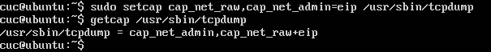

  * 安装Pydeep

    ```bash
    $ wget http://sourceforge.net/projects/ssdeep/files/ssdeep-2.13/ssdeep-2.13.tar.gz/download -O ssdeep-2.13.tar.gz
    $ tar -zxf ssdeep-2.13.tar.gz
    $ cd ssdeep-2.13
    $ ./configure
    $ make
    $ sudo make install
    
    #确认安装无误
    $ ssdeep -V
    Then proceed by installing pydeep:
    
    $ sudo pip install pydeep
    Validate that the package is installed:
    
    $ pip show pydeep
    ---
    Name: pydeep
    Version: 0.2
    Location: /usr/local/lib/python2.7/dist-packages
    Requires:
    ```

    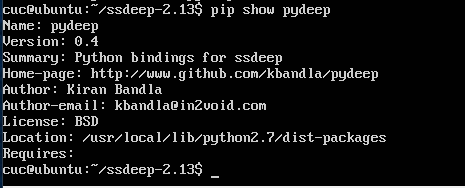

  * 安装Volatility

    如果需要启用内存镜像分析，需要安装volatility

    ```bash
    #先安装依赖
    $ sudo pip install openpyxl
    $ sudo pip install ujson
    $ sudo pip install pycrypto
    $ sudo pip install distorm3
    $ sudo pip install pytz 
    
    #然后安装volatility
    $ git clone git://github.com/volatilityfoundation/volatility.git
    $ cd volatility
    $ python setup.py build
    $ sudo python setup.py install
    
    #确认安装无误
    $ python vol.py -h
    ```

    

  * 安装Cuckoo

    ```bash
    #建议在virtualenv中安装（virtualenv就是用来为一个应用创建一套“隔离”的Python运行环境。）
    
    $ virtualenv venv
    $ . venv/bin/activate
    (venv)$ pip install -U pip setuptools
    (venv)$ pip install -U cuckoo
    ```

    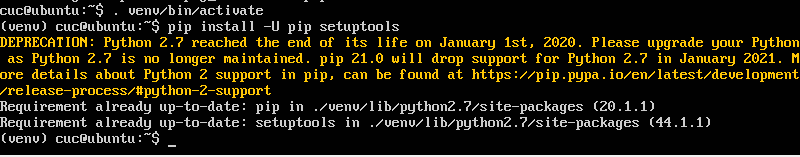

    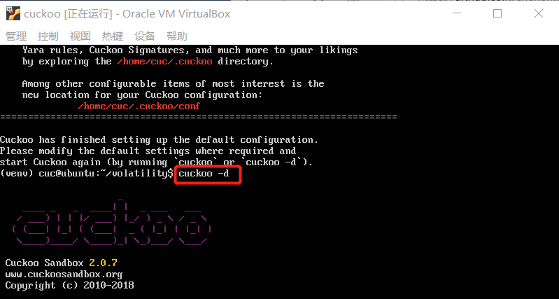

  * 初始化cuckoo，检查是否生成CWD文件(**不运行一次Cuckoo是不会自动生成的**) ，文件路径： /home/username(你的用户名)/.cuckoo/agent/agent.py 

    ```bash
    (venv)$ cuckoo -d
    ```

    

  * 设置IP报文转发

    ```bash
    $ sudo vim /etc/sysctl.conf
    net.ipv4.ip_forward=1
    $ sudo sysctl -p /etc/sysctl.conf
    ```

    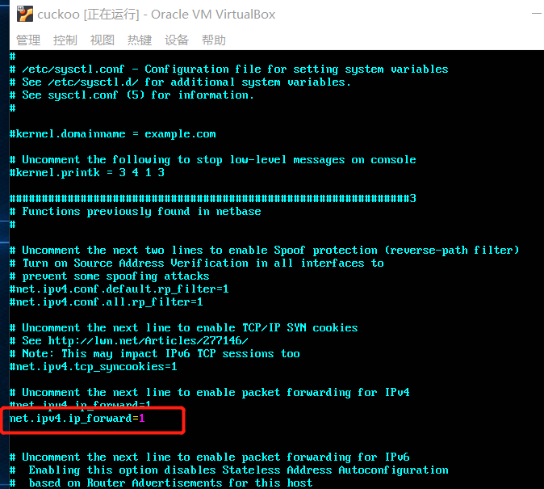

  * 使用iptables提供NAT机制,注意：其中eth0为Ubuntu中的网卡名称，需要提前查看自己Ubuntu中的网卡名称然后修改eth0

    ```bash
    $ sudo iptables -A FORWARD -o eth0 -i vboxnet0 -s 192.168.56.0/24 -m conntrack --ctstate NEW -j ACCEPT
    $ sudo iptables -A FORWARD -m conntrack --ctstate ESTABLISHED,RELATED -j ACCEPT
    $ sudo iptables -A POSTROUTING -t nat -j MASQUERADE
    $ sudo vim /etc/network/interfaces
    # 新增下列兩行
    pre-up iptables-restore < /etc/iptables.rules #开机自启动规则
    post-down iptables-save > /etc/iptables.rules #保存规则
    sudo apt-get install iptables-persistent
    sudo netfilter-persistent save
    #dns
    $ sudo apt-get install -y dnsmasq
    $ sudo service dnsmasq start
    ```

    

* Windows7

  * 安装python2.7\pillow

  * 关闭防火墙，自动更新等，Windows防火墙和自动更新可以在正常情况下影响恶意软件的行为，并且它们可以通过丢弃连接或包括不相关的请求来污染Cuckoo执行的网络分析

  * 修改网络配置

    * 添加主机Host-Only网卡

      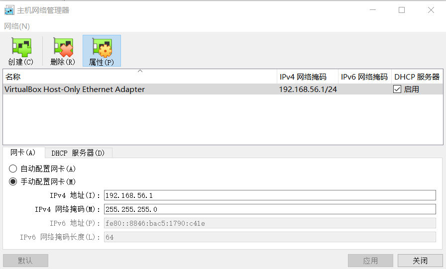

      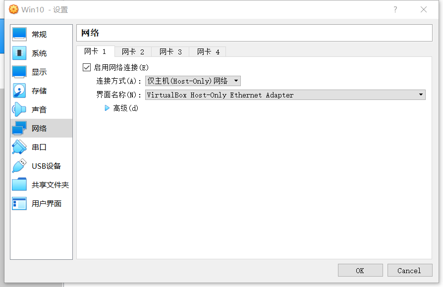

    * 进入Windowse网络设置，手动指定IP地址和DNS服务器地址

      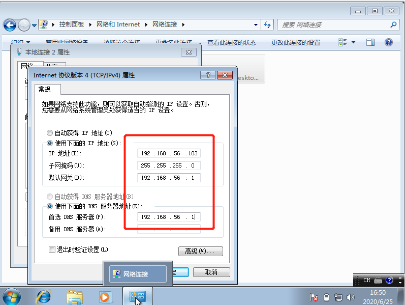

    * 检查双方是否能互相ping通
    
      ```
      $ ping 192.168.56.103
    $ ping 192.168.56.106
      ```
    
      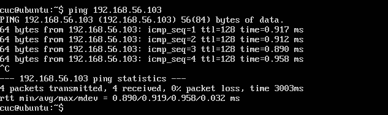
      
      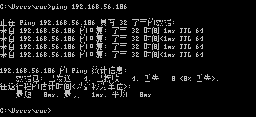
    
  * 安装agent.py

    * 将agent目录下的agent.py拷贝至win7文件系统，位置无严格要求；
  * 将agent.py修改成agent.pyw，并添加至开机启动项,agent.pyw为无界面模式；
    * 运行agent.pyw。

  * 保存win7快照

    * 在agent.pyw运行的状态下，保存win7快照，记录win7的ip地址和快照名称；

* Cuckoo配置

  配置文件路径：~/.cuckoo/conf

  * 配置virtualbox.conf

    ```bash
    $ vim virtualbox.conf
    machines = cuckoo1 # 指定VirtualBox中Geust OS的虚拟机名称
    [cuckoo1] # 对应machines
    label = cuckoo1  .
    platform = windows
    ip = 192.168.56.101 # 指定VirtualBox中Geust OS的IP位置
    #配置reporting.conf
    $ vim reporting.conf
    [jsondump]
    enabled = yes # no -> yes
    indent = 4
    calls = yes
    [singlefile]
    # Enable creation of report.html and/or report.pdf?
    enabled = yes # no -> yes
    # Enable creation of report.html?
    html = yes # no -> yes
    # Enable creation of report.pdf?
    pdf = yes # no -> yes
    [mongodb]
    enabled = yes # no -> yes
    host = 127.0.0.1
    port = 27017
    db = cuckoo
    store_memdump = yes 
    paginate = 100
    #配置cuckoo.conf
    version_check = no
    machinery = virtualbox
    memory_dump = yes
    [resultserver]
    ip = 192.168.56.102
    port = 2042
    ```
    

    
* 进入venv中，输入命令启动cuckoo服务：
  
  ```
    cuckoo
    ```
  
  
  
* 启动成功后，另外开出一个控制台，启动cuckoo web服务
  
  ```bash
    cuckoo web runserver
    ```
  
  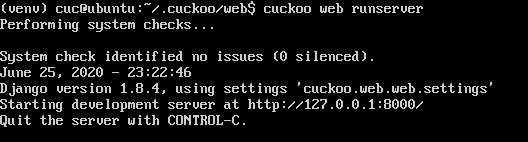
  
* 启动成功后打开网站
  
    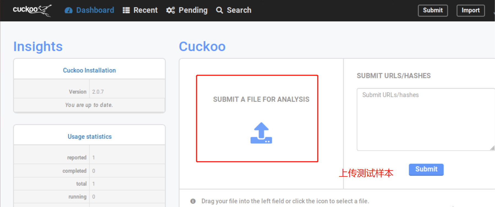

### 沙箱分析

* 上传样本后跳转至样本分析界面，左侧是分析参数设置，可以默认或修改参数；中间是要测试的样本，需要选中；然后点击右侧“Analyze”按钮，开始分析。

  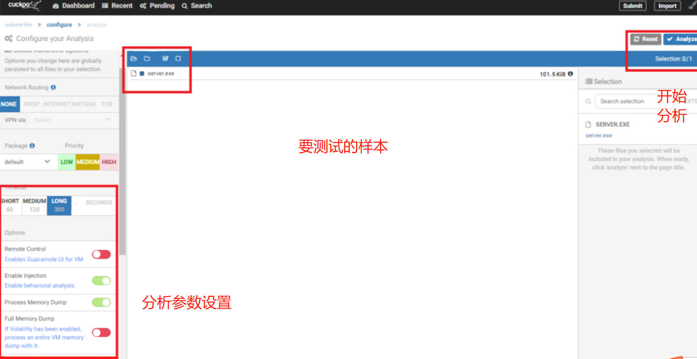


## 遇到的问题

* 安装`volatility`时起初用`git clone https://github.com/volatilityfoundation/volatility.git`失败，拉取时间过长才报的错，`clone http`方式换成`SSH`的方式，即 `https:// `改为` git://`
* 一定要保证磁盘空间足够的大

## 参考资料

* [在Ubuntu18.04上搭建Cuckoo Sandbox2.0.7](https://blog.csdn.net/qq_34256060/article/details/100035979)
* [关于git拉取项目时，报RPC failed; curl 18 transfer closed with outstanding read data remaining错的解决方案](https://blog.csdn.net/qq_37840993/article/details/102486352?utm_medium=distribute.pc_relevant.none-task-blog-BlogCommendFromMachineLearnPai2-1.nonecase&depth_1-utm_source=distribute.pc_relevant.none-task-blog-BlogCommendFromMachineLearnPai2-1.nonecase)
* [cuckoo环境搭建从零开始](https://blog.csdn.net/baobaoyu_/article/details/103047082)